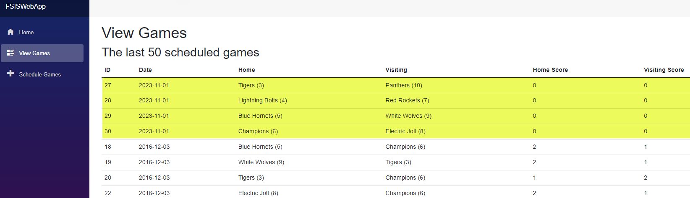
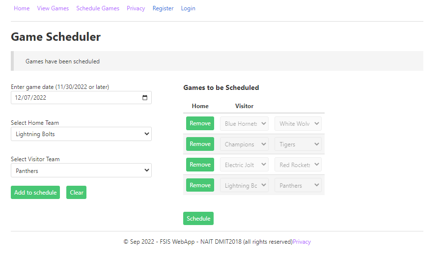
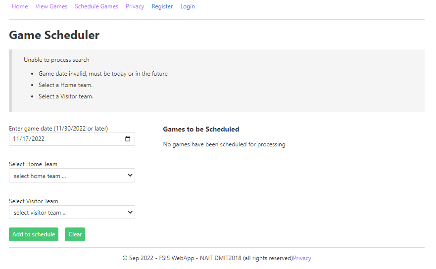
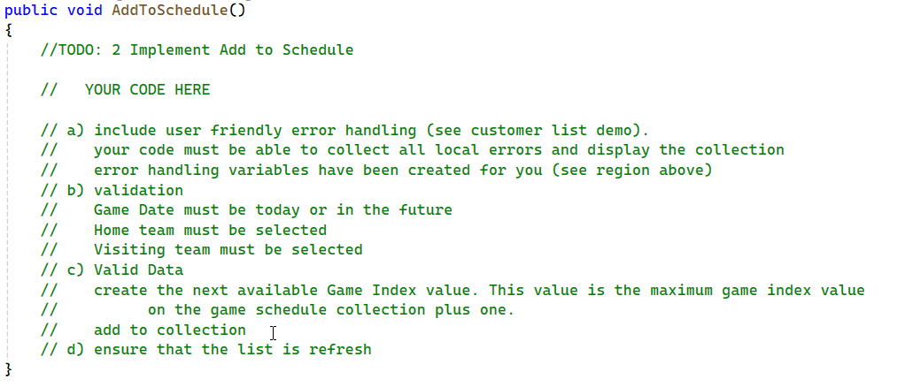
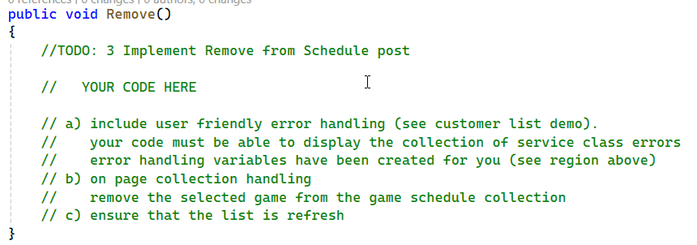
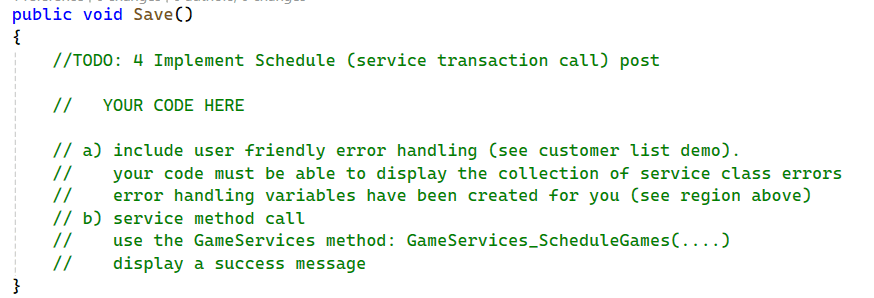
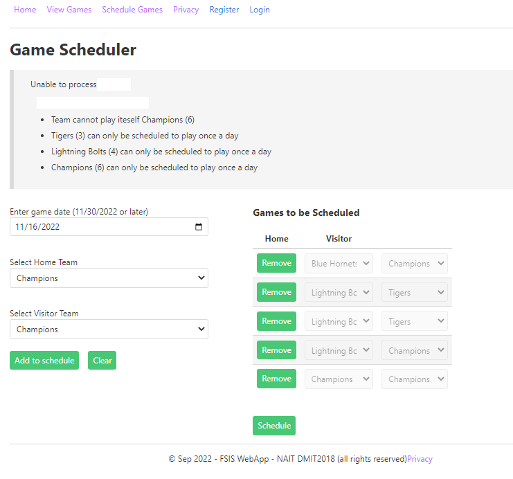

# In-Class Assessment - FSIS Integrated Web/OLTP - 

> Integrated Web/OLTP services -
> **Read the entire instructions before beginning your work**

Student Name: **YOUR_NAME**

> Place your name in the line above. **Work on the lab computer, not your laptop or personal computer**.

## Marking Summary

| Evaluation Item  | Weight | **Mark** | Comments |
|-------------------------------|:------:|:--------:|:--------:|
| Create web page table: Implement a table to be used as the view model collection      | 4      | **TBD** |   |
| Code: Add to Schedule: Validate data for game schedule record     | 2  | **TBD** |   |
| Code: Add to Schedule: Add a game schedule record to the view model collection              | 2      | **TBD** |   |
| Code: Remove From Schedule: Remove a game schedule record from the view model collection                 | 2      | **TBD** |   |
| Code: Schedule: call the GameServices method to register the game schedule collection to the database   | 2      | **TBD** |   |
| User friendly error handly: consistent throughout all methods, able to handle a collection of errors   | 2      | **TBD** |   |
| **Penalty** -  missing commits after every 10 minutes | -4 Max    | **TBD** |   |
| Total                                                                                                      | *14*   | **TBD** |   |

### Marking Rubric

| Weight | Breakdown |
| ----- | --------- |
| **1** | 1 = **Proficient** (requirement is met)<br />0 = **Incomplete** (requirement not met, missing large portions) |
| **2** | 2 = **Proficient** (requirement is met)<br />1 = **Limited** (requirement is poorly met, minor errors)<br />0 = **Incomplete** (requirement not met, missing large portions) |
| **3** | 3 = **Proficient** (requirement is met)<br />2 = **Capable** (requirement is adequately met, minor errors)<br />1 = **Limited** (requirement is poorly met, major errors)<br />0 = **Incomplete** (requirement not met, missing large portions) |
| **4** | 4 = **Proficient** (requirement is met)<br />3 = **Capable** (requirement is adequately met, minor errors)<br />2 = **Acceptable** (most requirements are adequately met, minor errors)<br />1 = **Limited** (requirement is poorly met, major errors)<br />0 = **Incomplete** (requirement not met, missing large portions) |

----

## Database

The physical database can be installed from the `.bacpac` file included in the starter kit.

## About FSIS

> **Fort Sasquatch Indoor Soccer** is a community soccer league.

## Requirements

## All work is to be done in within the supplied starter kit solution

In this assessment, you will be demonstrating your understanding of implementing a web page capable of collecting multiple records and process said collection in a transaction. In this assessment, you will be evaluated on the following:

- creating a html table capable of holding a collection of data to be processed as a transaction.
- Implement various methods events to manage the web page.
- Implement user friendly error handling within your method capable of managing multiple errors.

 The repository contains the database in a `.bacpac` file called **FSIS_2018.bacpac**. The starting VS C# web application solution has certain portions of the assessment pre-coded. **This code works and should not be altered.**

You are to complete each of the activities to create a successful solution to this assessment. You will need to use specified names in portions of the activities to integrate with the existing code. You many need to create local variables to use in your answer (these variables can be called whatever you wish). Use the following activity instructions to complete this assessment.

### Use Regular Commits

Commit your work at the end of every **Activity**. Ensure you sync your local clone to the classroom on GitHub before the end of class. The classroom access ends at
the end of class. **It is your responsibility that your work is properly submitted. Failure to submit your work will result is a mark of 0 (zero).**

### Setup

Restore the supplied SQL database by importing it as a Data-Tier Application. The database name is **FSIS_2018**. The database contains data for testing your solution. **You will have to alter the connection string in appsettings.json to use your sql server.** Run the solution.
Select View Games to see the last 50 scheduled, by date, games. Below is an example after successfully scheduling 4 new games.



### Activity 1 - Create web page table code

A web page, **AssessmentPages/GameScheduler**, has been partially coded. It requires a table to be code that will display/manage a view model collection of data.

Create a table to display the games to be scheduled
- use the view model technique to set up 3 hidden fields for the
                              BindProperty gameSchedule and field Index is GameIndex.
- set up a disable drop down list to display each team (Home and Visiting)
- set up a button, Remove, to be used to remove a row from a list. Tie the button
                            value to SelectedGame.



# NOTE:  All error handling will be handle in your methods.
### Activity 2 - Code the method: **Add to Schedule**.

Place your code within an user friendly error handling structure. The code should 

- validate the game date if today or in the future
- validate a home team was selected
- validate a visiting team was selected
- generate a value to be used as a technique index for the game to be scheduled
- create a new instance to be added to the view model collection
- add the instance to the collection

**Ensure that you look at the "Sample Validation Errors" below**

To generate the index value for the new instance:

- find the current maximum value for the GameIndex property
- add 1 to that value

**Sample of Validation errors**



**View Model: ScheduleView**

``` csharp
public class ScheduleView
{
        public int GameIndex { get; set; }
        public int HomeTeamID { get; set; }
        public int VisitingTeamID { get; set; }
}
```



### Activity 3 - Code the method: **Remove From Schedule**.

Place your code within an user friendly error handling structure. The code should 

- find the selected instance within the view model collection
- remove that instance



### Activity 4 - Code the method:  **Schedule (Save)**.

Place your code within an user friendly error handling structure. The code should 

- call the `GameServices_ScheduleGames(....)` method from the GameServices passing in the required data.
- issue a success message.



**Sample of Validation errors from service method**



 

# FSIS ERD


