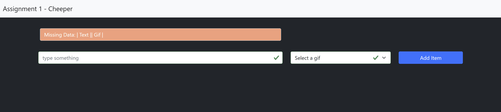
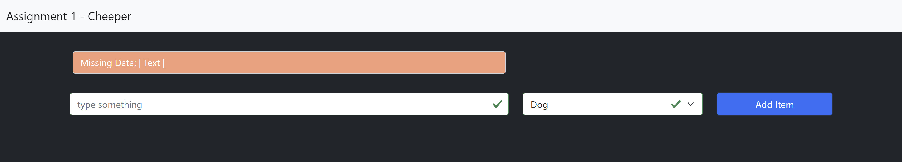
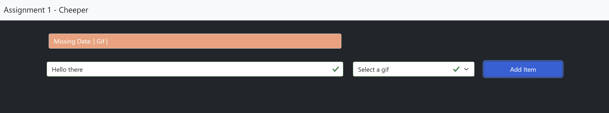
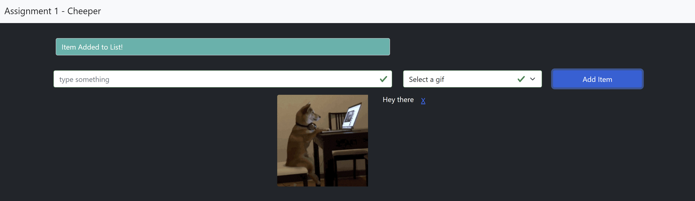
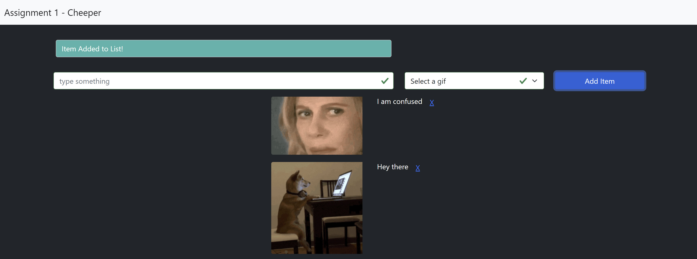

# Assignment 1: Cheeper – A Gif only twitter alternative.

## Introduction

This assignment builds on what you have learned in class through the exercises and assessments to this point.

This will test everything up to and including making decisions.

## Overview

For this assignment you are required to create `Cheeper`, a Gif only twitter alternative. 

You must be able to create `Cheeps` which are essentially tweets with gifs, except you only have 50 characters instead of twitters maximum. 

You need to validate the form and a `Cheep` needs both text and a gif or else show an error.

Below shows you some screen shots of your application that you need to build. The `HTML` and `CSS` have been provided for you. Do not change these files. Only add code to the begin.js file under each `TODO` comment.

Please refer to the `Required tasks` section to see how to build this assignment.

## Sample Screen Shots

### Error no text or gif. 


### Error no text but valid gif. 


### Error valid text but no gif. 


### Error text to long with valid gif. 


### Success Item added to list and then text and gif cleared.


### Success Second Item added to list.



## Required Tasks

1. An Event Listener listens to the “submit” event on the form.

- Prevents the form from submitting to the server.
- Gets the `text` and `gif` from the `event.target` element.
- Validates the inputs from the form element (see Validation of the inputs below)
- Creates an `item` (literal string in the js) only if the validation is successful.
- Resets the values if form validation is successful.

2. Validation of the inputs

- Text validation ensures that the `text` is not empty and it has `less than 50 characters`. Displays an error if it’s not valid.
- Gif validation ensures that a gif is selected and is not empty. Displays an error if it’s not valid.

3. Adding an `item` to the list.

- An `AddItemToList` function that takes two parameters: text and gif.
- Create an `item` with a literal string similar to the one shown below.

```javascript
  `
	<div class="d-flex mb-3">
		
		<h5 class='mx-3'>${text}</h5>
		<a class='delete-item' href="#">X</a>
	</div>
	`
```
- Add the most recent `item` to the top of the list.

