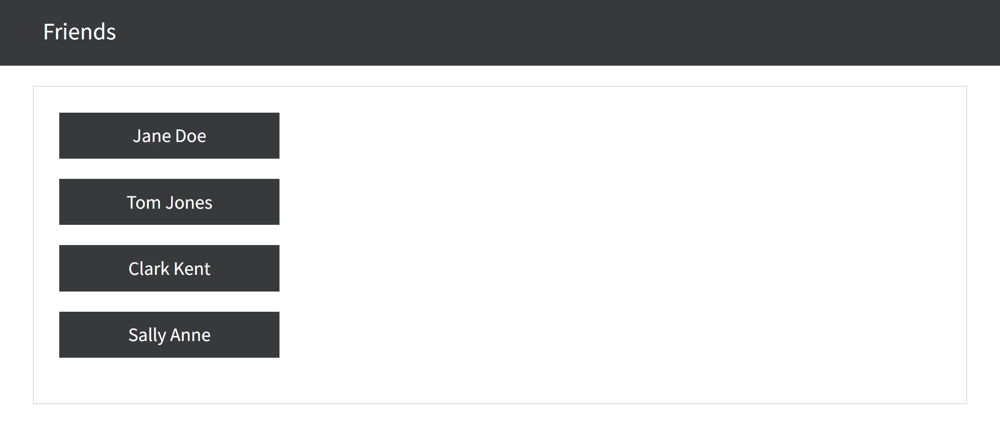
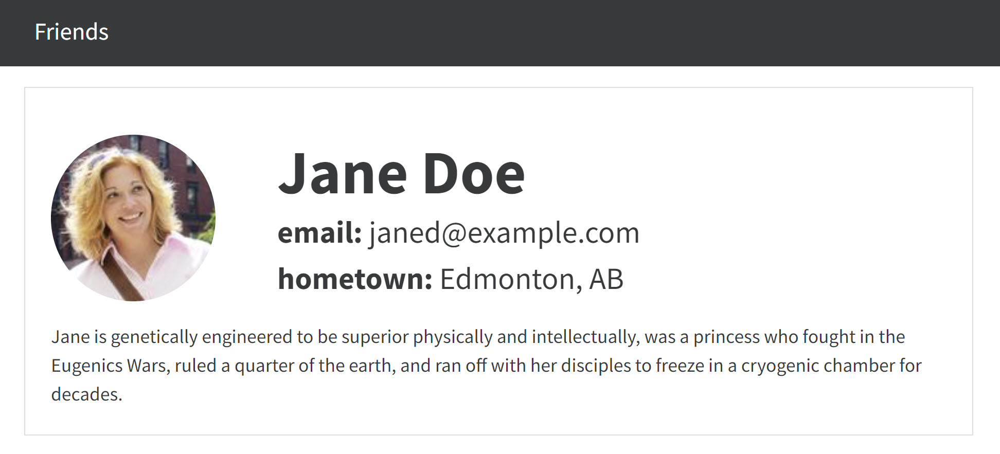

# Assignment 2: Friend Finder - with fetch and JSON

----

## Introduction

This assignment builds on what you have learned in class through the demos and exercises to this point.

This will test everything up to and including promises, fetch, async/await, and JSON.

----

## Overview

For this assignment you are required to create an app that presents data about a particular `friend` that is chosen from a group of `friends`.

- Below shows some screen shots of the application that you need to build. 
- The `HTML` and `CSS` have been provided for you. 
  - Do not change these files. 
  - You can add to the `main.css` file if required. 
- Also some of the required `JS` code is provided. 
  - Do not change the provided `JS` code in the `begin.js` file. 
  - Only add `JS` code to the `begin.js` file under each `TODO` comment.

Remember to commit your work frequently with relevant comments, and then push to GitHub.

----

## Sample Screen Shots

### After pressing the `Friends` button in the navbar. 

### After pressing on a particular `friend` button. 

----

## Required Tasks

1. An Event Listener listens to the “click” event of the button labeled `Friends` in the top nav-bar.

   - When the button labeled `Friends` is pressed four other buttons will appear in a `card` in the `
` element.
   - Each of the other four buttons will be labeled with a `friends full name`.

2. An Event Listener listens to the “click” event of any of the other four buttons labeled with a `friends full name`.

   - When any one of the other four buttons is pressed, corresponding information about the chosen `friend` will appear in a `card` in the `
` element.
   - This `card` of the chosen `friend's` information will replace the four other buttons.

3. To be able to chose another `friend`, start the process over by clicking the button labeled `Friends` in the top nav-bar.

