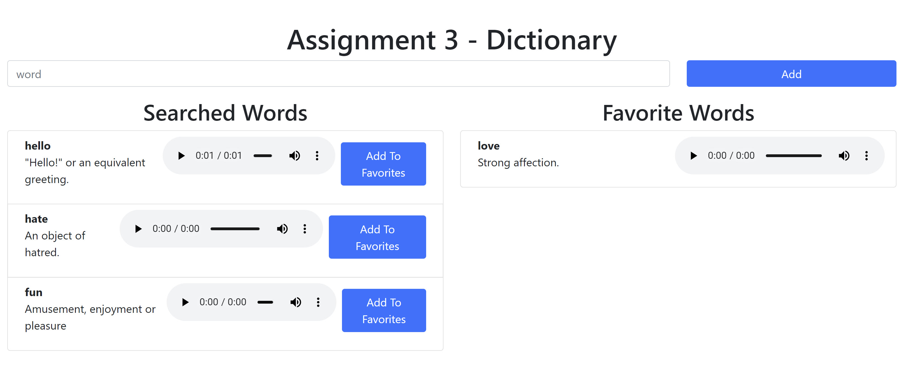

# Assignment 3: Dictionary

----

## Introduction

This assignment builds on what you have learned in class through the demos and exercises to this point.

This will test everything up to and including fetch, npm, and DOM manipulation.

----

## Overview

- For this assignment you are required to create an app that acts as a dictionary word search tool.

- Note that we will be using an external rest API https://dictionaryapi.dev/ to search words and populate them on the page.

-	When you click `add` your application will search the word using the free dictionary rest api and add the html (structure provided in the JavaScript) to the `searched-words` list.

-	When you click the `Add to favorites` button the word will move from `searched` to the `favorite-words` list.

- Below shows some screen shots of the application that you need to build.

- The `HTML` and `CSS` have been provided for you. 
  - Do not change these files. 
  - You can add to the `main.css` file if required.

- Also some of the required `JS` code is provided. 
  - Do not change the provided `JS` code in any of the `.js` files. 
  - Only add `JS` code to the `.js` files under each `TODO:` comment.

Remember to commit your work frequently with relevant comments, and then push to GitHub.

----

## Sample Screen Shots

### After a number of words have been looked up and one sent to favorites. 

----